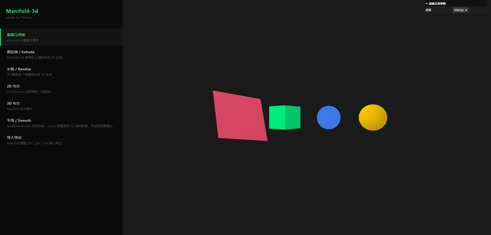

<div align="center">

# 🧊 Manifold 案例展示

**基于 [Manifold-3d](https://github.com/elalish/manifold) 的交互式建模演练场，使用 [Three.js](https://threejs.org/) 实时渲染。**

[English](./README.md) · [报告问题](#) · [提出建议](#)

</div>

<div align="center">


</div>

---

## ✨ 特性

一组精心挑选的交互式案例，演示 **Manifold-3d** 的核心建模能力，每个案例都附带可实时调整的 `lil-gui` 参数面板。

| # | 案例 | 说明 |
|---|------|------|
| 1 | **基础几何体** | Manifold 内置基本图形（立方体、球体、圆柱体……） |
| 2 | **拉伸 Extrude** | 2D 截面沿 Z 轴拉伸生成 3D 实体 |
| 3 | **车削 Revolve** | 2D 截面绕 Y 轴旋转生成 3D 实体 |
| 4 | **2D 布尔** | `CrossSection` 交 / 并 / 差（线框模式渲染） |
| 5 | **3D 布尔** | `Manifold` 交 / 并 / 差，对实体网格运算 |
| 6 | **平滑 Smooth** | `Manifold.smooth` + `refine` 构造 G1 连续曲面，可选保留硬边 |
| 7 | **导入导出** | 通过 `@gltf-transform` 进行 `gltf` / `glb` / `3mf` 的双向转换 |

---

## 📸 截图

> 截图请放到 `docs/screenshots/` 目录下，文件名与 `src/cases/index.ts` 中的 `<case-key>` 一一对应。

<div align="center">
  
</div>

---

## 🚀 快速开始

### 环境要求

- **Node.js ≥ 18**
- 推荐使用 **pnpm**，也支持 `npm` / `yarn`

### 安装

```bash
pnpm install
```

### 运行

```bash
pnpm dev          # 启动 Vite 开发服务器
pnpm build        # 类型检查（tsc --noEmit） + 生产构建
pnpm preview      # 预览生产构建产物
pnpm typecheck    # 仅运行 TypeScript 类型检查
```

打开 <http://localhost:5173>，从左侧侧边栏选择案例。URL 的 hash 路由会反映当前案例（`#/case/<key>`），可直接分享。

---

## 🧱 技术栈

| 库 | 版本 | 作用 |
|---|---|---|
| [`manifold-3d`](https://www.npmjs.com/package/manifold-3d) | ^3.5.1 | CSG 建模内核（WASM） |
| [`three`](https://www.npmjs.com/package/three) | ^0.184.0 | WebGL 渲染与场景图 |
| [`@gltf-transform/*`](https://gltf-transform.dev/) | ^4.4.0 | glTF / glb / 3mf 读写 |
| [`lil-gui`](https://www.npmjs.com/package/lil-gui) | ^0.21.0 | 每个案例的参数面板 |
| [`vite`](https://vitejs.dev/) | ^8.0.0 | 开发服务器与打包工具 |
| [`typescript`](https://www.typescriptlang.org/) | ^6.0.0 | 类型保障 |

---

## 🏗️ 架构

```
src/
├── main.ts                 # 入口：引导 SceneApp
├── style.css
├── core/
│   ├── SceneApp.ts         # 装配 Sidebar + Stage + CaseManager，处理路由
│   ├── Sidebar.ts          # 左侧案例选择器
│   ├── Stage.ts            # Three.js 画布 + 相机/轨道控制
│   ├── CaseManager.ts      # 挂载 / 卸载当前案例
│   ├── registry.ts         # 案例中央注册表 + 懒加载器
│   ├── router.ts           # 解析 / 构造 #/case/<key> 路由
│   └── types.ts
├── cases/                  # 每个案例一个目录（懒加载）
│   ├── index.ts            # registerCase(...) 入口
│   ├── base-shape/
│   ├── extrude-shape/
│   ├── revolve/
│   ├── 2d-boolean/
│   ├── 3d-boolean/
│   ├── smooth/
│   └── import-export/
├── utils/
│   ├── manifold.ts         # wasm 初始化 + 工具方法
│   └── three.ts            # three.js 工具方法
└── assets/
```

### 案例注册机制

每个案例独立成目录，通过 [`src/cases/index.ts`](./src/cases/index.ts) 中统一的 `registerCase(...)` 调用注册。**侧边栏必须在案例模块下载完成前渲染**，因此 `name` / `description` 在此重复声明 —— 这是懒加载注册表模式的固有代价。

### 路由

URL hash 格式为 `#/case/<key>`。空 hash 或非法 hash 会回退到第一个已注册案例，且不会改写 URL。

---

## ➕ 新增案例

1. **新建** `src/cases/<your-case>/index.ts`，`export default` 一个 `Case` 实例。
2. **在** `src/cases/index.ts` **中注册**：

   ```ts
   registerCase({
     key: 'your-case',
     name: '你的案例',
     description: '显示在侧边栏的简短描述',
     load: () => import('./your-case').then((m) => m.default),
   });
   ```

完成 —— 侧边栏入口、懒加载 chunk、`#/case/your-case` 路由都会自动生成。

---

## 📜 脚本

| 脚本 | 说明 |
|---|---|
| `pnpm dev` | 启动 Vite 开发服务器（带 HMR） |
| `pnpm build` | 类型检查并构建生产产物 |
| `pnpm preview` | 本地预览生产构建 |
| `pnpm typecheck` | 仅运行 `tsc --noEmit` |

---

## 📄 许可证

[MIT](./LICENSE) © 2026 —— 欢迎学习、fork 与二次开发。

---

<div align="center">
  <sub>用 ❤️ 与 Manifold-3d、Three.js 一起构建。</sub>
</div>
